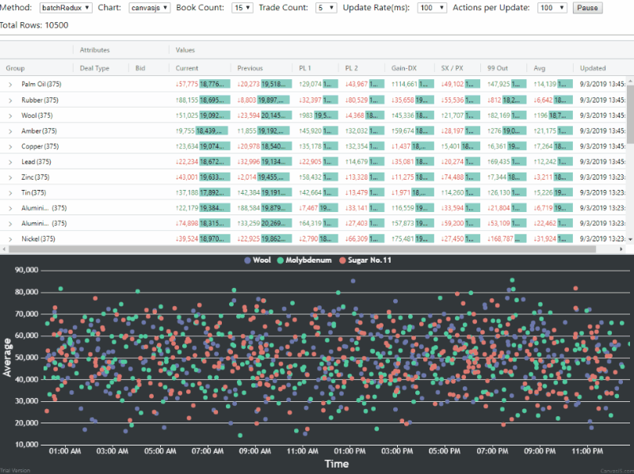

## AG-Grid Stress Test using React/Redux



This is, primarily, a conversion of the [AG-Grid Streaming Stress Test](https://blog.ag-grid.com/streaming-updates-in-javascript-datagrids/) that uses React and Redux. Also, Socket IO is used for streaming data, instead of using web workers.

The suggested method for handling updates when using React and Redux in the Ag-Grid documentation is to pass rowData as a prop to the AgGridReact component with the 'deltaRowDataMode' option turned on. This method is not performant when dealing with a large dataset and many updates per second.

The method employed here is straightforward:

1. When rowData is initially set in Redux, a map of row ids to array indexes is created. When updates come in, the id/index map is used when iterating over the array of incoming updates, to generate the modified rowData. This isn't strictly necessary to update data in the grid (see next item), but is needed so that rowData stored in Redux stays up to date for other purposes (displaying charts, in this case). See [data reducer](src/store/data/reducer.js)

2. Each incoming array of updates is set in Redux, and this is passed to batchRowUpdate in the component after checking for a change to the updates prop in componentDidUpdate. See [Grid using batchUpdateRowData method](src/Tests/BatchRedux.js)

This project also serves as something of a playground for me to learn different chart visualization libraries. Echarts and CanvasJS have been implemented so far.

To run, first start the server with

```
yarn server
```

Then start the app with

```
yarn start
```
